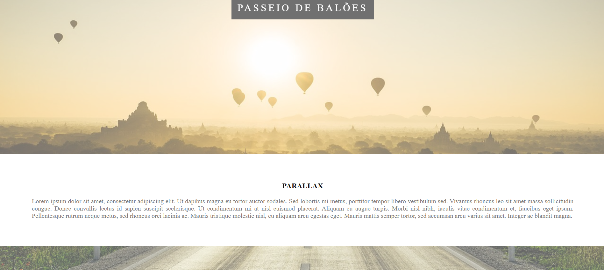

# Parallax Website

Projeto desenvolvido utilizando **HTML5 e CSS3** com aplicação do efeito **Parallax**.

O objetivo deste projeto foi praticar técnicas de estilização avançada no CSS, trabalhando com imagens de fundo, posicionamento de elementos e criação de uma experiência visual através do efeito de rolagem.

---

## Tecnologias Utilizadas

- HTML5
- CSS3

---

## Estrutura do Projeto

```text
Parallax
│
├── README.md
├── index.html
│
└── src
    ├── estilo.css
    └── imagens
```

---

## Sobre o Projeto

O projeto apresenta uma página visual utilizando o efeito Parallax, onde diferentes imagens permanecem fixas enquanto o conteúdo é movimentado durante a rolagem da página.

Foram criadas seções com diferentes cenários:

- Passeio de Balões
- Estrada
- Pôr do Sol

---

## Conceitos Aplicados

Durante o desenvolvimento foram praticados:

- Estrutura HTML5
- CSS3
- Background Image
- Efeito Parallax
- Posicionamento com CSS
- Organização de arquivos
- Criação de layouts visuais

---

## Demonstração do Projeto

### Página Inicial



---

## Como Executar

1. Clone este repositório.

2. Abra o arquivo:

```
index.html
```

3. Execute no navegador.

---

## Objetivo

Projeto desenvolvido para praticar fundamentos de desenvolvimento web e compor meu portfólio.

---

## Autor

**André Campos**